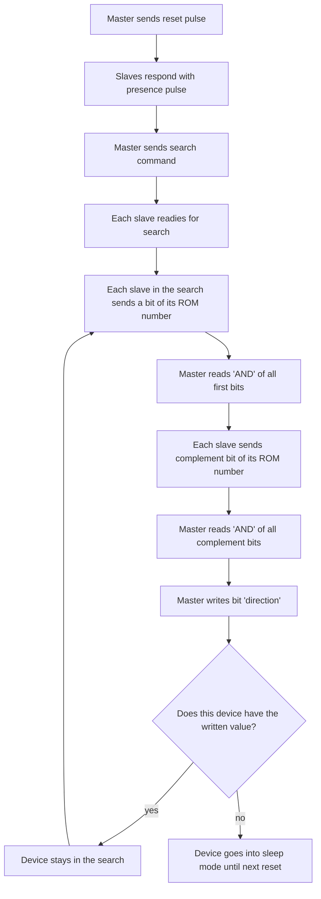

# A brief overview of 1-Wire communication 
Lydia Calderon-Aceituno | August 9, 2021

This overview is based on a TI documentation avaliable [here](https://www.ti.com/lit/an/spma057c/spma057c.pdf?ts=1628471224920) and [here](https://www.maximintegrated.com/en/design/technical-documents/app-notes/1/126.html). Useful videos for reference include a [video guide](https://www.youtube.com/watch?v=UIx8R1LV6HM) and a short [Maxim introduction to 1-Wire](https://www.youtube.com/watch?v=CjH-OztKe00).

1-Wire is a serial signaling protocol like SPI or I2C, with the key difference that power, data, and timing can be sent over only one wire. This transfer is half-duplex (bidirectional but cannot have data going both ways at the same time). Typical set up involves a spare PIO pin from a microcontroller connected to a pull-up resistor and slave(s). Data transmission is bit-sequential, with the LSB transmitted first. Each 1-Wire capable device comes with a unique and unalterable 64-bit ID or ROM number that comes in three chunks: the least significant 8 bits of the address give the family code of the device, the next least 48 bits give the serial number of the device, and the most significant 8 bits give the CRC (Cyclic Redundancy Check) generated from the least 56 bits. Most 1-Wire devices are parasitically powered via an internal capacitor. 

## Timing
The 1-Wire bus is normally HIGH, pulled up by a pull-up resistor. If the master or the slaves want to send a signal, they have to pull the bus down. A 0 is signalled by a long pull down and a 1 is signalled by a short pull down. The timing for the communication is laid out in the following paragraph, and can be found on page 3 of the DS2781 datahsheet. 

Each bit sent must fit into a tSLOT. To send a 0, the bus must be pulled down for tLOW0 and to send a 1 the bus must be pulled down for tLOW1. Between each bit, the bus must be left high for a recovery time of tREC. Prior to a bit sequance, a reset low tRSTL must be sent from the master to all the slaves. After this reset low there is a waiting period tPDH until the slaves start to respond by pulling the bus low for tPDL to let the master know that they are ready to go. The entire "slave activity interval" from when the master releases the reset low to when the master can again manipulate the bus is tRSTH, the reset high.

| Parameter | Symbol | Min | Max | Units |
|-----------| -------|-----|-----|-------|
| Time slot | tSLOT | 60 | 120 | µs|
| Write-0 time | tLOW0 | 60 | 120 | µs|
| Write-1 time | tLOW1 | 1 | 15 | µs|
| Recovery time | tREC | 1 | | µs|
| Reset low | tRSTL | 480 | 960 | µs|
| Waiting period (presence detect) | tPDH | 15 | 60 | µs|
| Presence detect low | tPDL | 60 | 240 | µs|
| Reset high | tRSTH | 480 | | µs|

**NOTE**: These times are for **standard operation**. Different times apply for overdrive mode. 

### A harsh reality: dealing with timing issues 
In order to execute the times for different 1-Wire signals, [1-Wire documentation](https://www.maximintegrated.com/en/design/technical-documents/app-notes/1/126.html) uses the mbed method `wait_us` and always inputs the exact times required by 1-Wire. This can cause problems when actually implementing code as the functions to change the state of the bus and the `wait_us` function itself both take up time just to be called and executed. The times required, using Mbed OS 6 on an NXP LPC1768, are as follows:

| Function | Purpose | Approx. overhead time | 
|-----------| -------|-------|
| `wait_us`| Administer a wait in microseconds| > 10  µs| 
| `wait_ns`| Administer a wait in nanoseconds | unknown |
| `input` | Method used to change the mode of a GPIO pin to input | 2 µs | 
| `output` |  Method used to change the mode of a GPIO pin to input | unknown |

Due to these unexpected time issues there are communication timings throughout the code that do not agree with 1-Wire documentation and where alternate timing methods have been implemented to achieve more precise communication. 

## Typical communication flow 
Each communication starts with a reset sequence. If the master must determine which slaves are present on the bus, the master should perform a search to detect/collect the unique and unalterable ROM number of each slave device. Before performing an operation on a device, the device must be configured and/or selected using the
ROM commands. Some of the available functional ROM commands are:
* Read ROM [`0x33`]: Only used when there is a single slave on the bus. This command reads the ROM number of the only slave present on the bus.
* Match ROM [`0x55`]: This command followed by a 64-bit ROM number selects the slave with the matching ROM number All other devices wait until the next reset pulse.
* Search ROM [`0xF0`]: This command is required to obtain the ROM numbers of multiple devices, and it informs slave devices that a search is going to be conducted by the master. The Search is
then conducted by reading a bit and its complement of the ROM numbers from the slaves and sending an appropriate bit back. Slave devices that have the same bit as the one sent by the master remain active while others wait for the next reset.
* Skip ROM [`0xCC`]: Devices can be addressed without the master knowing the ROM numbers. This command is helpful when giving a common command to all the devices.
* Overdrive Skip ROM [`0x3C`]: This command is the same as the Skip ROM command with the exception that only devices that can run in overdrive mode remain active and go into overdrive mode. Devices that cannot run in overdrive mode wait for the next reset. 
* Overdrive Match ROM [`0x69`]: This command is the same as Match ROM command with the exception that the device is only matched if it can run in overdrive mode. All other devices wait for the next reset. 

Typically after each operation, a reset pulse is issued. 

### Graphical representation 

## The search algorithm 
1-Wire devices each have a 64-bit unique registration number in read-only memory (ROM) that is used to address them individually by a 1-Wire master in a 1-Wire network. If the ROM numbers of the slave devices on the 1-Wire network are not known, then using a search algorithm can discover them. Reference documentation for this section can be found [here](https://www.maximintegrated.com/en/design/technical-documents/app-notes/1/187.html). 

Like all other communication on the 1-Wire bus, the seach algorithm begins with a reset pulse. After this pulse, the search command SEARCH_ROM [`0xF0`] must be sent, to which all `participating slaves respond by simultaneously sending the first bit (least significant) in their ROM number. Because all of these bits are sent simultaneously, the bit read by the master is actually the bit-wise AND of the bits sent by the slaves. The complement of the first bit is then sent by all of the slaves, and that bit-wise AND is also read by the master. From these two bits, information can be derived about the first bit in the ROM numbers of the participating devices.

According to the search algorithm, the 1-Wire master must then send a bit back to the participating devices. If the participating device has that bit value, it continues participating. If it does not have the bit value, it goes into a wait state until the next 1-Wire reset is detected. This 'read two bits' and 'write one bit' pattern is then repeated for the remaining 63 bits of the ROM number. In this way the search algorithm forces all but one device to go into this wait state. At the end of one pass, the ROM number of this last device is known. On subsequent passes of the search, a different path (or branch) is taken to find the other device ROM numbers. Note that this document refers to the bit position in the ROM number as bit 1 (least significant) to bit 64 (most significant). This convention was used instead of bit 0 to bit 63 for convenience, to allow initialization of discrepancy counters to 0 for later comparisons.

Using this search algorithm, the ROM ID of an individual device can be found by connecting it to the 1-Wire bus and calling `find_first_device`. This function will store the ROM ID in a char array, which can be collected as a ull by calling `whoAmI` and then displayed as a hexidecimal value.